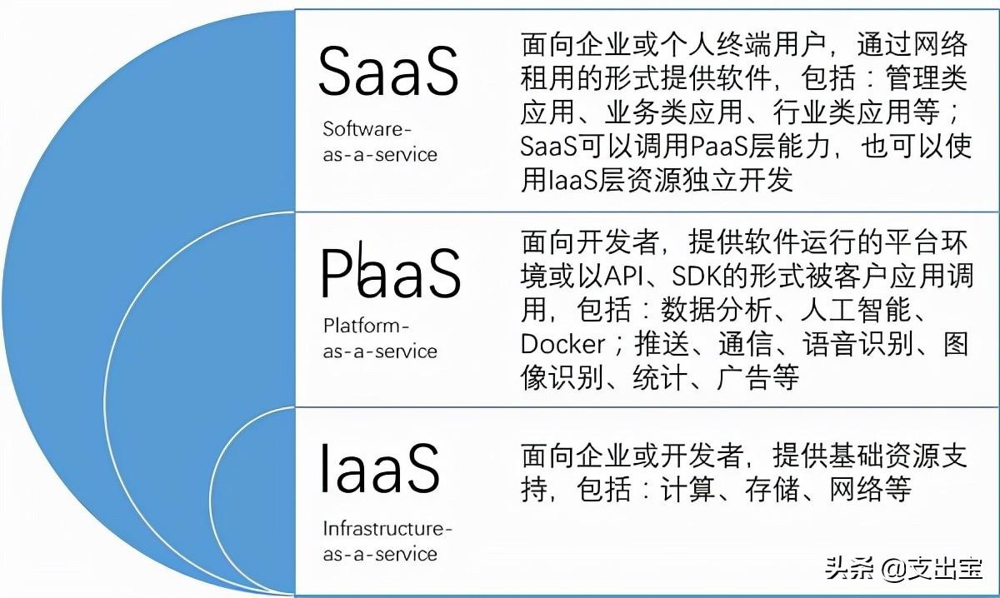
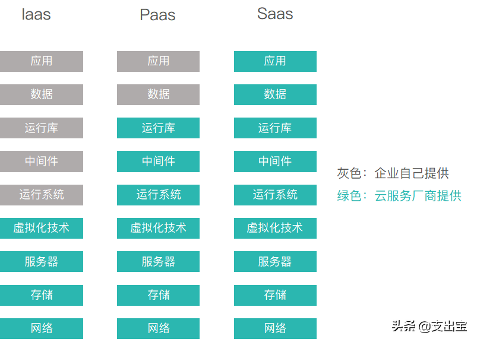
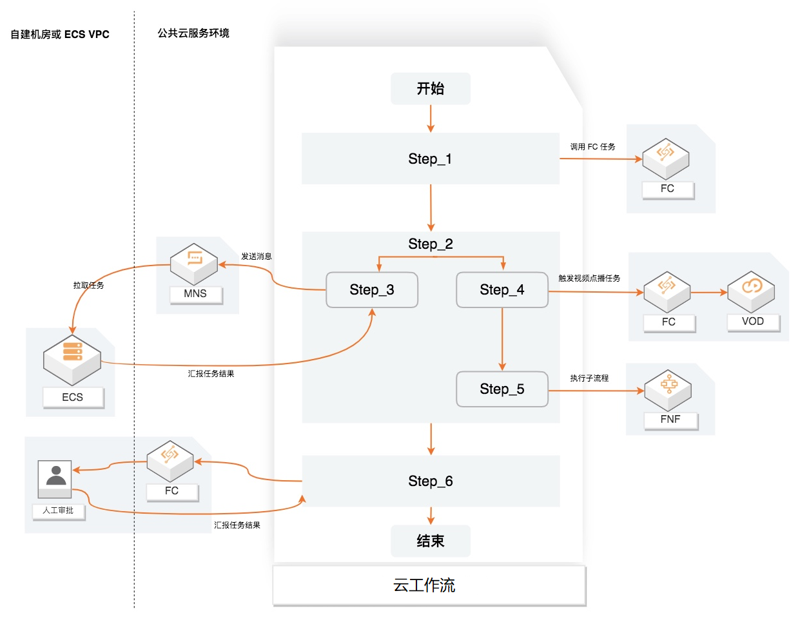

# 1.了解相关概念
## 云服务
参考：https://zhuanlan.zhihu.com/p/407517204
### 1 IaaS-基础设施服务
IaaS是基础设施即服务。英文全称是Infrastructure as a server。
概念：需要帮助客户搭建好运行服务的基础设施，就是在线下筹备机房或机器，组成环境运行能够提供服务的项目并部署该项目提供服务。
举例：举例说就是我要在提供服务之前给客户那边搭建好线下的运行环境，比如在高校的校园中选择一个房间作为机房，在准备电脑进行组网，将项目运行在搭建好的机器上面就可以进行服务的访问。

优势：
自主性，灵活性，安全性较高
劣势：
不易扩展
成本较高
### 2 PaaS-平台服务
PaaS是平台即服务，英文全称是Platform as a Server。
概念：利用云端搭建好操作系统或软件层面的如数据库、中间件等供用户使用，使得用户无需关注底层的基础设施和运行环境，只需要利用这些环境运行自己的应用和数据。
举例：就好比学校要使用我的就业管理系统进行管理，但是不想自己搭建机房和环境，所以就直接本地用少量的机器搭建客户端，将数据库、中间件或部分接口放在云端，请求时直接请求云端的接口和数据。

优势：
节省部分资源
较容易资源扩展
劣势：
自主性，灵活性一般
### 3 SaaS-软件服务
SaaS是软件即服务。英文全称是Software as a Server。
概念：即云端已经将操作系统到运行环境到软件的客户端都已经搭建好了，使用方不需要安装任何环境或软件，只需要访问客户端就能直接使用、
举例：类似于在毕业生管理系统上，先自己利用云端搭建好平台，然后如果有学校想要使用的话直接分配给他们一些账号和密码，他们就可以直接访问搭建好的系统进行操作了。

优势：
节省资源和运维成本
劣势：
安全性一般

### 服务层次的区别
IaaS，提供最底层服务。最接近服务器硬件资源，这样用户可以以最大的自由度接入网络本身；
PaaS，提供更高一层服务。整体服务向用户隐藏了底层的网络，存储，操作系统等等技术问题，也就是说底层服务对用户是透明的，而向用户开放的是软件本身的开发和运行环境；
SaaS，提供最上层服务。大部分用户会用简单客户端的方式调用该层级的服务。用户可以根据自己的需求，通过网络向供应商订制商业模型，一些比较简单的例子是Google的文档，表格等等。

### 云工作流
参考：https://www.alibabacloud.com/help/zh/serverless-workflow/latest/what-is-cloudflow
云工作流（CloudFlow）是一个用来协调多个分布式任务执行的全托管云服务。

在云工作流中，您可以用顺序、分支、并行等方式来编排分布式任务，云工作流会按照设定好的步骤可靠地协调任务执行，跟踪每个任务的状态转换，并在必要时执行您定义的重试逻辑，以确保工作流顺利完成。云工作流通过提供日志记录和审计来监视工作流的执行，方便您轻松地诊断和调试应用。云工作流简化了开发和运行业务流程所需要的任务协调、状态管理以及错误处理等繁琐工作，让您聚焦业务逻辑开发。

下图描述了云工作流如何协调分布式任务，这些任务可以是函数、已集成云服务API、运行在虚拟机或容器上的程序。

## 机器学习
### 1 LLM RAG Prompt token Emdedding Fine-Tune
参考：
机器学习 https://www.runoob.com/ml/ml-tutorial.html
RAG      https://zhuanlan.zhihu.com/p/668082024
LLM      https://zhuanlan.zhihu.com/p/622518771
         https://zhuanlan.zhihu.com/p/654041855
         https://zhuanlan.zhihu.com/p/7211320820
其它     https://zhuanlan.zhihu.com/p/640226606
### 2.什么是LLM和LLM的发展历程？
大语言模型：LLM（Large Language Models），是试图完成文本生成任务的一类ML（Machine Learning，机器学习）模型。
LLM使计算机能够处理、解释和生成人类语言，从而提高人机交互效率。为了做到这一点，LLM会分析大量文本数据或基于这些数据进行训练，从而学习句子中各词之间的模式和关系。
这个学习过程可以使用各种数据源，包括维基百科、Reddit、成千上万本书，甚至互联网本身。
在给定输入文本的情况下，这个学习过程使得LLM能够预测最有可能出现的后续单词，从而生成对输入文本有意义的回应。
在过去的2年中，市场上发布的一些现代语言模型非常庞大（如GPT系列模型、文心一言、通义千问、Kimi、豆包等等），并且已经在大量文本上进行了训练，因此它们可以直接执行大多数NLP任务，如文本分类、自动翻译、问题回答、生成文本等。

LLM的发展可以追溯到几年前。它始于简单的语言模型，如n-gram模型、LSTM网络等等，直到Transformer模型的出现，才彻底的催生了LLM。

#### 2.1 N-gram模型
n-gram模型通过使用词频来根据前面的词预测句子中的下一个词，其预测结果是在训练文本中紧随前面的词出现的频率最高的词。虽然这种方法提供了不错的着手点，但是n-gram模型在理解上下文和语法方面仍需改进，因为它有时会生成不连贯的文本。

#### 2.2LSTM网络
为了提高n-gram模型的性能，人们引入了更先进的学习算法，包括循环神经网络(recurrent neural network，RNN)和长短期记忆(long short-termmemory，LSTM)网络。与n-gram模型相比，这些模型能够学习更长的序列，并且能够更好地分析上下文，但它们在处理大量数据时的效率仍然欠佳。尽管如此，在很长的一段时间里，这些模型算是最高效的，因此在自动翻译等任务中被广泛使用。

#### 2.3 Transformer模型
Transformer架构彻底改变了NLP领域，这主要是因为它能够有效地解决之前的NLP模型存在的一个关键问题：很难处理长文本序列并记住其上下文。（也就是臭名昭著的“灾难性遗忘问题”），Transformer则具备高效处理和编码上下文的能力。
这场革命的核心支柱是注意力机制，这是一个简单而又强大的机制。模型不再将文本序列中的所有词视为同等重要，而是在任务的每个步骤中关注最相关的词。

Transformer 的核心是用注意力机制替代传统的循环神经网络（RNN）或卷积神经网络（CNN），通过计算输入序列中各个元素之间的相关性，动态分配权重，从而捕捉长距离依赖关系。
##### 2.3.1 自注意力机制：
自注意力（Self-Attention）：计算同一序列内部元素之间的关系（例如一句话中各个词的相关性）
让模型关注输入序列内部的关联性，比如：
在句子 "The cat ate the fish because it was hungry." 中，"it" 应该指代 "cat" 还是 "fish"？自注意力机制会计算 "it" 与句子中其他词的关联度，从而正确解析指代关系。
自注意力让模型动态决定哪些词更重要，而不是像 RNN 那样只能按顺序处理。

##### 2.3.2 交叉注意力机制
交叉注意力（Cross-Attention）：计算两个不同序列之间的关系（例如机器翻译中源语言句子和目标语言句子的对应关系）。
让模型关注两个不同序列之间的关系，例如：
在机器翻译中，英文句子 "I love you" 和法文句子 "Je t'aime" 之间的对应关系。
在图像描述生成（Image Captioning）中，图像特征和生成文本之间的关联。
交叉注意力让模型从另一个序列中提取相关信息，类似于“查询-检索”过程。

### 3 RAG
#### 3.1 RAG 是什么？
RAG 的核心思想是：让模型在生成答案前，先从一个外部知识库中检索相关信息，再基于检索到的内容生成更准确、可靠的回答。
相当于给大模型配了一个“实时搜索引擎”，避免它仅依赖训练时的记忆（可能过时或不完整）。

类比理解
纯生成模型（如不开联网搜索的GPT）：像是一个“闭卷考试”的学生，只能靠自己的记忆答题，容易编造答案。

RAG 模型：像是一个“开卷考试”的学生，可以随时查资料再作答，答案更靠谱。

#### 3.2 RAG 的架构
检索增强生成（Retrieval Augmented Generation），简称 RAG
RAG 通常分为两个核心阶段：

检索（Retrieval）：从外部知识库（如文档、数据库）中查找与问题相关的片段。
生成（Generation）：将检索到的内容输入生成模型（如LLM），合成最终答案。

具体流程
用户提问（Query）：例如 “量子计算的主要应用有哪些？”

检索模块：
将问题编码成向量（如用BERT或稠密检索模型）。
从知识库中搜索最相关的文档片段（如Top-3相关段落）。

生成模块：
将检索到的段落 + 用户问题一起输入LLM（如GPT）。
LLM 基于检索内容生成答案，并标注引用来源。

#### 3.3 为什么需要 RAG？
传统生成模型的痛点
幻觉（Hallucination）：模型可能编造不存在的事实（如虚构人物、事件）。
知识滞后：模型训练后，无法获取新知识（如2024年的新闻）。
长尾问题：对冷门知识（如专业论文）的覆盖不足。

RAG 的优势
✅ 动态知识更新：只需更新检索库，无需重新训练模型。
✅ 可解释性：答案基于检索内容，可追溯来源（适合企业场景）。
✅ 降低成本：避免将海量知识全部预训练到模型中。

#### 3.4RAG 对比 Fine-Tuning
| 特性                | RAG                                   | 微调（Fine-Tuning）                  |
|---------------------|---------------------------------------|--------------------------------------|
| **知识更新方式**     | 动态更新检索库（无需改模型）          | 需重新训练模型                       |
| **计算成本**         | 低（仅需检索+生成）                   | 高（全模型训练，GPU资源消耗大）       |
| **适用场景**         | 开放域问答、实时信息需求              | 特定任务优化（如客服分类、风格迁移）  |
| **抗幻觉能力**       | 强（答案依赖检索内容，可溯源）        | 依赖训练数据质量，可能编造未见过内容  |
| **数据依赖性**       | 依赖外部知识库的覆盖率和质量          | 依赖标注数据的规模和代表性            |
| **灵活性**           | 高（可随时扩展知识库）                | 低（修改需重新训练）                 |
| **典型工具**         | LangChain、FAISS、DPR                 | HuggingFace Trainer、LoRA/QLoRA      |
| **延迟**             | 较高（需检索时间）                    | 低（直接生成）                       |

### 其它常见概念
#### Prompt：
提示词
是输入给大模型的文本，用来提示或引导大模型给出符合预期的输出。我们向大模型提问的文本就是提示词，而大模型在理解了我们的提示词后就在提示词的下面会给出对应的回答。

#### Token：
词汇片段
我们可以经常在大模型的计费说明中看到Token这个词，Token是大模型处理的最小单元，比如英文单词或者汉字。
Token长度 = 与大模型交互时使用的单词、汉字数
不同的人表达同一件事情时，有的人言简意赅几句话就能把事情说得明明白白，而有的人可能表达能力不好，非常的啰嗦，才能把这件事情说清楚。那么很明显这个啰嗦的人在描述这件事情上消耗的Token就比前面那个人多了很多。

#### Emdedding：
嵌入
是将段落文本编码成固定维度的向量，便于进行语义相似度的比较。
我们可以理解成把知识数据向量化成一个数据库，是为了方便检索，这让用户在提问的时候，我们就可以根据用户的提问内容，在数据库中提取相关度比较高的材料，一起给到大模型，这样大模型就能用这些专业的知识做出更加具备专业水平的回答了。
打个比方，Emdedding就像是当一个项目启动时，项目经理把待完成需求所依据的额外相关材料先整理好，提取重点后放在附件中给到研发工程师，便于研发工程师高效的输出符合预期的东西。
Embedding是向量化的一种高级形式

#### Fine-Tune：
微调
在已经训练好的模型基础上进一步调整模型的过程，是一种使用高质量数据对模型参数进行微调的知识迁移技术，目的是让模型更匹配对特定任务的理解。
本质是迁移学习，即利用预训练阶段习得的通用知识（如语言结构、常识），通过少量目标数据（如医疗报告、法律文书）的针对性训练，快速提升模型在特定场景下的性能

举个例子，微调类似于摄影师从“全能拍”到“人像专精”。假设一位摄影师（预训练模型）已掌握构图、光影、色彩等通用技能（预训练知识），现需要转型为人像摄影师（目标任务）