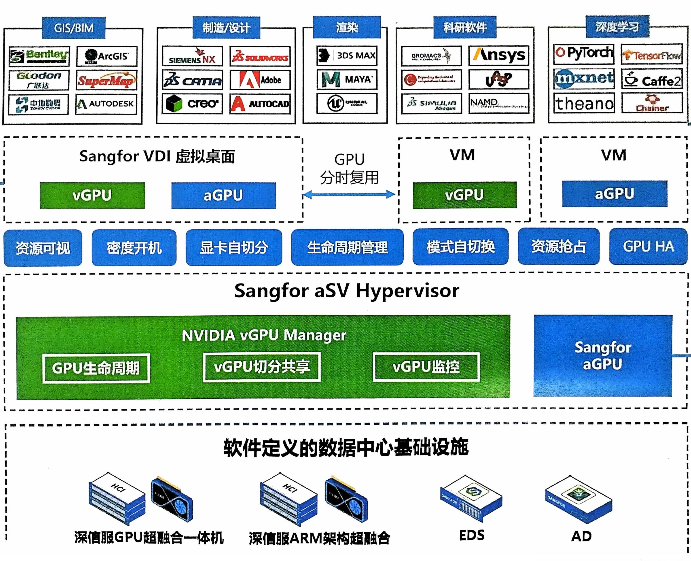

# 2.AI生成框架图


## AI生成框架图流程
### 描述图像
直接让AI描述图片语言达不到理想程度，先自己描述
方法是从整体到局部
```
共有五个竖直排列的大框架，上下布局，第一行排在最上面，第五行排在最下面
第一行大框架里有五个横向排列小框架，五个小框架名称分别为GIS/BIM，制造/设计，渲染，科研软件，深度学习

GIS/BIM里有六个小小框架，排列成三行两列，分别为Glodon，ArcGIS，AUTODESK，Bentley，中地数码，SuperMAp，
制造/设计里有六个小小框架，排列成三行两列，分别为SiEMENSNX，adobe，SOUDWORKS，creo，AUTOCAD，CATIA
渲染里有三个小小框架，分别为3DS MAX,MAYA,UNREAL ENGINE
科研软件有五个小小框架，排列成三行两列，分别为Ansys,NAMD,Simulia，VASP,GROMACS
深度学习有六个小小框架，排列成三行两列，分别为Pytorch,mxnet,theano，TensorFlow，Caffe2，Chainer

第二行大框架里有两个横向排列的小框架，名称分别为sangfor VDI虚拟桌面和VM
sangfor VDI虚拟桌面里有vGPU和aGPU，VM里也有vGPU和aGPU
两个小框架之间有双向箭头，上面写着GPU分时复用

第三行框架有7个横向排列小框架，分别为资源可视，密度开机，显卡自切分，生命周期管理，模式自切换，资源抢占， GPU HA

第四行大框架名为Sangfor aSV Hypervisor
有两个小框架横向排列，分别为NVIDIA vGPU Manager 和Sangfor aGPU
NVIDIA vGPU Manager 有三个小小框架横向排列分别为GPU生命周期，vGPU切分共享和vGPU监控 
Sangfor aGPU里没有内容

第五行大框架名为软件定义的数据中心基础设施 
含有四个横向排列小框架，分别是HCI深信服GPU超独合一体机，深信服ARM架构超融合， EDS和AD
```
把描述语言按框架分成五个模块然后向deepseek描述每一个框架，一步一步给出mermaid代码并改进
### 返回的mermaid代码
```
graph TD
    %% 强制定义五个大框架的垂直顺序（从上到下）
    第一行 --> 第二行 --> 第三行 --> 第四行 --> 第五行

    %% 第一行大框架（横向排列的5个子框架）
    subgraph 第一行[" "]
        direction LR  %% 横向排列所有子框架

        subgraph GIS/BIM
            Glodon
            ArcGIS
            AUTODESK
            Bentley
            中地数码
            SuperMap["SuperMAp"]
        end

        subgraph 制造/设计
            SiemensNX["SiEMENSNX"]
            Adobe["adobe"]
            SolidWorks["SOUDWORKS"]
            creo
            AUTOCAD
            CATIA
        end

        subgraph 渲染
            3DS_MAX["3DS MAX"]
            MAYA
            UNREAL_ENGINE["UNREAL ENGINE"]
        end

        subgraph 科研软件
            Ansys
            NAMD
            Simulia
            VASP
            GROMACS
        end

        subgraph 深度学习
            Pytorch
            mxnet
            theano
            TensorFlow
            Caffe2
            Chainer
        end
    end

    %% 第二行大框架（强制横向排列的两个子框架）
    subgraph 第二行[" "]
        direction LR  %% 关键修改：强制子框架横向排列
        subgraph sangfor_VDI["sangfor VDI虚拟桌面"]
            vGPU1[vGPU]
            aGPU1[aGPU]
        end
        subgraph VM
            vGPU2[vGPU]
            aGPU2[aGPU]
        end
        sangfor_VDI -- "GPU分时复用" --> VM
        VM -- "GPU分时复用" --> sangfor_VDI
    end

    %% 第三行大框架（7个横向功能模块）
    subgraph 第三行[" "]
        资源可视
        密度开机
        显卡自切分
        生命周期管理
        模式自切换
        资源抢占
        GPU_HA["GPU HA"]
    end

    %% 第四行大框架（横向排列的两个子框架）
    subgraph 第四行["Sangfor aSV Hypervisor"]
        direction LR  %% 横向排列
        subgraph NVIDIA_vGPU["NVIDIA vGPU Manager"]
            GPU生命周期
            vGPU切分共享
            vGPU监控
        end
        subgraph Sangfor_aGPU["Sangfor aGPU"]
            %% 空框架
        end
    end

    %% 第五行大框架（横向排列的4个子框架）
    subgraph 第五行["软件定义的数据中心基础设施"]
        HCI["HCI深信服GPU超独合一体机"]
        深信服ARM架构超融合
        EDS
        AD
    end

    %% 隐藏辅助连接线（仅用于控制布局）
    linkStyle 0 stroke-width:0px;

    %% 样式设置
    classDef bigFrame fill:#f0f0f0,stroke:#333,stroke-width:2px;
    classDef smallFrame fill:#e6f3ff,stroke:#666;
    classDef miniFrame fill:#fff,stroke:#999;
    
    class 第一行,第二行,第三行,第四行,第五行 bigFrame;
    class GIS/BIM,制造/设计,渲染,科研软件,深度学习,sangfor_VDI,VM,NVIDIA_vGPU,Sangfor_aGPU,HCI,深信服ARM架构超融合,EDS,AD smallFrame;
    class Glodon,ArcGIS,AUTODESK,Bentley,中地数码,SuperMap,SiemensNX,Adobe,SolidWorks,creo,AUTOCAD,CATIA,3DS_MAX,MAYA,UNREAL_ENGINE,Ansys,NAMD,Simulia,VASP,GROMACS,Pytorch,mxnet,theano,TensorFlow,Caffe2,Chainer,vGPU1,aGPU1,vGPU2,aGPU2,GPU生命周期,vGPU切分共享,vGPU监控 miniFrame;
    class 资源可视,密度开机,显卡自切分,生命周期管理,模式自切换,资源抢占,GPU_HA smallFrame;
```
### 将代码输入到mermaid编辑器中自动生成框架图
https://www.min2k.com/tools/mermaid/
选上下布局，导出图像

## 概念了解
GIS
BIM
VDI
vGPU
aGPU
VM
GPU HA
sangfor VDI
Sangfor aSV Hypervisor
EDS
AD


### 1. GIS（地理信息系统，Geographic Information System）
- **定义**：用于采集、存储、分析、管理和展示地理空间数据的计算机系统。
- **核心功能**：
  - 空间数据可视化（如地图）
  - 空间分析（如路径规划、区域划分）
  - 数据叠加（如将人口数据与地形结合）
- **应用场景**：城市规划、环境监测、灾害管理、物流优化等。

---

### 2. BIM（建筑信息模型，Building Information Modeling）
- **定义**：通过数字化技术对建筑项目的物理和功能特性进行建模的过程。
- **核心特点**：
  - **3D模型**：包含几何、材料、成本等信息
  - **全生命周期管理**：从设计、施工到运维
  - **协同工作**：多专业（结构、机电等）共享同一模型
- **应用场景**：建筑设计、施工模拟、设施管理等。

---

### 3. VDI（虚拟桌面基础设施，Virtual Desktop Infrastructure）
- **定义**：将用户桌面环境（操作系统、应用）集中部署在数据中心的虚拟化技术。
- **工作原理**：
  - 用户通过终端设备（如瘦客户端）远程访问虚拟桌面
  - 资源（CPU、内存）由服务器池动态分配
- **优势**：集中管理、数据安全、灵活访问（任何设备、任何地点）
- **代表厂商**：VMware Horizon、Citrix Virtual Apps、**Sangfor VDI**

---

### 4. vGPU（虚拟图形处理器，Virtual GPU）
- **定义**：将物理GPU资源分割为多个虚拟GPU，供多个虚拟机共享。
- **用途**：加速虚拟环境中的图形渲染、AI计算等。
- **技术实现**：
  - NVIDIA GRID：支持多用户共享GPU
  - GPU直通（Passthrough）：独占式分配
- **应用场景**：云游戏、CAD设计、深度学习

---

### 5. aGPU（加速图形处理器，Accelerated GPU）
- **定义**：广义指通过GPU加速计算任务（如AI、科学计算），但有时特指外部GPU（eGPU）或特定厂商方案。
- **与vGPU区别**：
  - aGPU可能指物理GPU直接加速
  - vGPU是虚拟化后的共享资源

---

### 6. VM（虚拟机，Virtual Machine）
- **定义**：通过虚拟化技术模拟的完整计算机系统，运行在物理主机上。
- **特点**：
  - 隔离性：多个VM互不干扰
  - 灵活性：动态分配资源（CPU、内存）
- **管理程序（Hypervisor）**：
  - Type 1（裸金属）：如VMware ESXi、**Sangfor aSV**
  - Type 2（宿主机）：如VirtualBox

---

### 7. GPU HA（GPU高可用性，GPU High Availability）
- **定义**：确保GPU资源在故障时自动切换，保障业务连续性。
- **实现方式**：
  - 集群化：多GPU节点冗余
  - 故障检测：自动迁移任务到健康节点
- **应用场景**：关键图形渲染、实时AI推理

---

### 8. Sangfor VDI（深信服虚拟桌面基础设施）
- **厂商**：深信服（Sangfor）推出的VDI解决方案。
- **特点**：
  - 支持Windows/Linux虚拟桌面
  - 集成安全防护（防病毒、数据加密）
  - 优化协议（低带宽需求、流畅体验）
- **适用场景**：企业远程办公、教育实验室

---

### 9. Sangfor aSV Hypervisor（深信服虚拟化平台）
- **定位**：深信服自研的Type 1 Hypervisor。
- **功能**：
  - 虚拟机管理（创建、迁移、快照）
  - 资源池化（CPU/内存/存储）
  - 与Sangfor其他产品（如安全组件）深度集成
- **竞品**：VMware vSphere、华为FusionSphere

---

### 10. EDS（企业级分布式存储，Enterprise Distributed Storage）
- **定义**：面向企业的高性能、高可靠分布式存储系统。
- **关键技术**：
  - 横向扩展（节点增加容量和性能）
  - 数据冗余（副本或纠删码）
  - 支持块/文件/对象存储
- **应用**：大数据分析、私有云存储

---

### 11. AD（活动目录，Active Directory）
- **定义**：微软开发的目录服务，用于集中管理网络资源。
- **核心功能**：
  - **身份认证**：用户/设备登录验证
  - **权限管理**：基于组策略（GPO）控制访问
  - **资源组织**：域（Domain）、OU（组织单元）分层结构
- **应用场景**：企业IT资产管理、单点登录（SSO）

---

### 总结表
| 缩写 | 全称/解释                     | 主要用途                          |
|------|-----------------------------|---------------------------------|
| GIS  | 地理信息系统                  | 空间数据分析和可视化              |
| BIM  | 建筑信息模型                  | 建筑设计、施工协同                |
| VDI  | 虚拟桌面基础设施               | 远程办公、安全访问                |
| vGPU | 虚拟GPU                      | 共享GPU资源给多个虚拟机           |
| aGPU | 加速GPU（或外部GPU）          | 高性能计算/图形处理               |
| VM   | 虚拟机                       | 服务器整合、多环境隔离            |
| GPU HA| GPU高可用性                 | 保障关键GPU任务不间断运行         |
| Sangfor VDI | 深信服虚拟桌面方案      | 企业级安全远程桌面                |
| Sangfor aSV | 深信服虚拟化平台         | 替代VMware的国产Hypervisor       |
| EDS  | 分布式存储                    | 海量数据存储、高可用              |
| AD   | 活动目录                     | 企业用户/设备集中管理             |