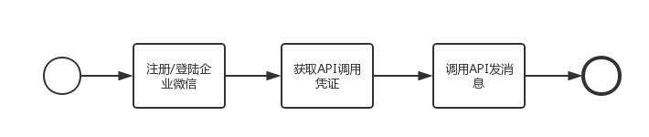

# 3.企业微信应用
参考：
企业微信wedemo的github仓库 https://github.com/Tencent/WeDemo
企业微信开发者中心 https://developer.work.weixin.qq.com/document/
企业微信API概述 https://qiyeweixin.apifox.cn/
Postman https://www.postman.com/
Apifox  https://app.apifox.com/main/teams/3432041?tab=project
Apifox使用教程 https://www.bilibili.com/video/BV1Jc41147xC/?vd_source=0d9baa5a79922fff9fc8d9332c0d93f4
artmate https://aigc.cuc.edu.cn/my/message/list
libib

企业微信
1.每月固定充值画卷
2.画卷低于阈值发出预警

添加自建应用
登录企业微信管理端 -> 应用与小程序 -> 应用 -> 自建，点击“创建应用”，设置应用logo、应用名称等信息，创建应用。
创建完成后，在管理端的应用列表里进入该应用，可以看到agentid、secret等信息，这些信息在使用企业微信API时会用到。
创建完成后，该应用会自动出现在可见范围内的成员的企业微信终端上（包括手机端、pc端、微信插件）

使用工具调试api
我们已经创建好一个自建应用，且拿到了可用的应用id及secret，如何调用api控制这个应用呢？下面以发消息为例说明如何调试api接口。

调用api的过程，本质上就是发送http请求给企业微信后台，在正式开发前，我们可以使用工具模拟http请求调试api。这里以 postman 为例，当然你也可以使用其它http模拟工具。

发消息api见发送应用消息，可以看到其实就是一个post请求
请求方式：POST（HTTPS）
请求地址： https://qyapi.weixin.qq.com/cgi-bin/message/send?access_token=ACCESS_TOKEN
post 参数为 access_token 和 消息体。

1.获取access_token

参考开始开发，access_token是应用调用api的凭证，由 corpid和corpsecret换取。

请求方式：GET（HTTPS）
请求URL：https://qyapi.weixin.qq.com/cgi-bin/gettoken?corpid=ID&corpsecret=SECRET
使用postman发送这样一个GET请求即可得到access_token（请把截图中的corpid、corpsecret换为自己的corpid、应用secret）
2.构造消息体

参考发送应用消息，可以发送文本、图片、视频等多种类型的应用消息，这里以最简单的文本消息为例：（注意修改touser、agentid为自己想要的接收者userid列表、应用id）

{
   "touser" : "abelzhu|ZhuShengben",
   "msgtype" : "text",
   "agentid" : 1000002,
   "text" : {
       "content" : "我就试一下"
   },
   "safe":0
}
3.发送消息

如下图示，以上面两步得到的access_token和消息体为参数，在postman中发送post请求即可（红色箭头所指为需要注意的点）
如果发送成功，在接收者的企业微信中的相应应用里，会收到一条文本消息。